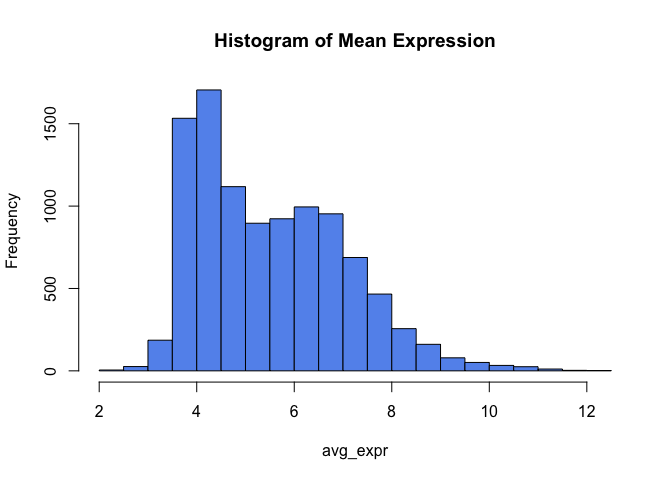
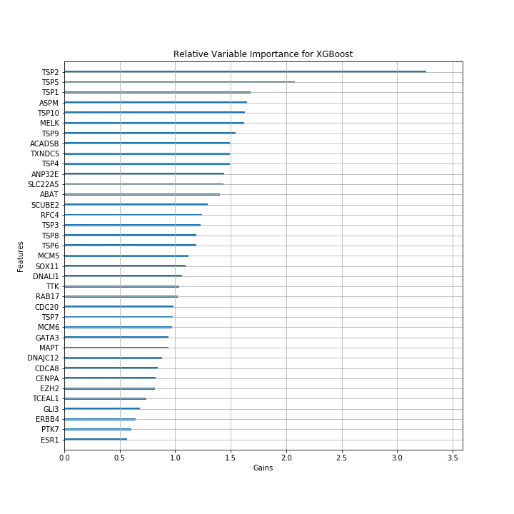

Introduction
============

The binary response we will be considering is called “pathological
complete response” (pCR). After a patient has undergone cancer
treatment, a pathologist will examine the patient’s tissue for any
remnant cancer cells. If the pathologist finds no evidence of cancer
cells remaining, the patient will be given a label of *p**C**R* = 1. If
cancer cells were found after treatment, the patient will be instead be
given *p**C**R* = 0. It is of great interest to patients and clinicians
to try to predict which pCR response a patient may end up having prior
to receiving any cancer treatments.

For the binary response, we have 18 studies. Loading in the file
pCR\_binary.RData, we will find three list objects, pCR, XX\_pCR, and
pam50\_pCR. pCR is a list of 18 binary response (pCR) vectors, so
calling pCR\[\[1\]\] retrieves the pCR patient responses for the first
study. XX\_pCR is a list of 18 matrices, with each matrix containing the
biomarker expressions for the patients of a study. Therefore, calling
XX\_pCR\[\[1\]\] yields a matrix of dimensions (number of biomarkers) by
(number of patients for study 1). The row names of each matrix
correspond to the biomarker names. We have been given 10,115 biomarkers
for consideration (corresponding to the \# of rows of each matrix), and
these are the same ones across all 18 studies.

pam50\_pCR is a list with the pam50 predictor vectors, coded as a
categorical variable corresponding to five breast cancer subtypes. This
predictor is commercialized by a company called Prosigna. Using a
logistic regression with pam50\_pCR as the predictor and pCR as the
response, we will obtain an AUC that serves as a benchmark for
classification performance. Note that some vectors of pam50\_pCR have
missing values NA so will only be able to evaluate our benchmark on a
subset of all studies. The challenge given to us by Prof. Parmigiani is
to train a classifier for pCR response using the matrices in XX\_pCR
with gene expressions for a total of 1,309 patients in 18 studies.

Exploratory Data Analysis
=========================

We will begin our data analysis by visualizing our gene expressions,
response variables and addressing any problems that may arise.

Analyzing the Gene Expressions Pooled Across Studies
----------------------------------------------------

First, let’s pool all of the data and do some basic EDA.

``` r
load("data/pCR_binary.RData")

# Initialize df to be filled using first study
XX_full = t(XX_pCR[[1]])
YY_full = pCR[[1]]
ZZ_full = rep(1, length(YY_full))
df_full = cbind(XX_full,YY_full,ZZ_full)
N_genes = dim(XX_full)[2]

# fill df
for (ii in 2:18) { 
  XX_full = t(XX_pCR[[ii]])
  YY_full = pCR[[ii]]
  ZZ_full = rep(ii, length(YY_full))
  
  df = cbind(XX_full,YY_full,ZZ_full)
  df_full = rbind(df_full, df)  
}

XXX = df_full[,1:(ncol(df_full) - 2)]
YYY = df_full[,ncol(df_full) - 1]
ZZZ = df_full[,ncol(df_full)]
gene_names = colnames(XXX)
```

Now that we have pooled expression levels, let’s visualize mean and
standard deviation expression levels for our biomarkers.

``` r
avg_expr = apply(XXX, 2, mean)
sd_expr = apply(XXX, 2, sd)
hist(avg_expr, main = "Histogram of Mean Expression", col = "cornflowerblue")
```



``` r
hist(sd_expr, main = "Histogram of SD of Expression", col = "cornflowerblue")
```


It appears that the majority of low expression and low variance
biomarkers have already been removed from our dataset. This allows us to
proceed without throwing out any biomarkers due to low
expression/variance.

Analyzing the Responses:
------------------------

By printing the response variable for each study, we notice a few
troubling things right off the bat.

``` r
Ns = c()
for (ii in 1:18) { 
  print(summary(pCR[[ii]]))
  Ns = c(Ns, length(pCR[[ii]]))
}
```

    ##    Min. 1st Qu.  Median    Mean 3rd Qu.    Max. 
    ##  0.0000  0.0000  0.0000  0.1404  0.0000  1.0000 
    ##    Min. 1st Qu.  Median    Mean 3rd Qu.    Max. 
    ##  0.0000  0.0000  1.0000  0.6981  1.0000  1.0000 
    ##    Min. 1st Qu.  Median    Mean 3rd Qu.    Max. 
    ##  0.0000  0.0000  0.0000  0.2107  0.0000  1.0000 
    ##    Min. 1st Qu.  Median    Mean 3rd Qu.    Max. 
    ##  0.0000  0.0000  0.0000  0.1786  0.0000  1.0000 
    ##    Min. 1st Qu.  Median    Mean 3rd Qu.    Max. 
    ##  0.0000  0.0000  0.0000  0.1613  0.0000  1.0000 
    ##    Min. 1st Qu.  Median    Mean 3rd Qu.    Max.    NA's 
    ##  0.0000  0.0000  0.0000  0.2602  1.0000  1.0000       5 
    ##    Min. 1st Qu.  Median    Mean 3rd Qu.    Max. 
    ##    0.00    0.00    0.00    0.15    0.00    1.00 
    ##    Min. 1st Qu.  Median    Mean 3rd Qu.    Max. 
    ##  0.0000  0.0000  0.0000  0.1639  0.0000  1.0000 
    ##    Min. 1st Qu.  Median    Mean 3rd Qu.    Max. 
    ##       0       0       0       0       0       0 
    ##    Min. 1st Qu.  Median    Mean 3rd Qu.    Max. 
    ##  0.0000  0.0000  0.0000  0.1946  0.0000  1.0000 
    ##    Min. 1st Qu.  Median    Mean 3rd Qu.    Max. 
    ##       0       0       0       0       0       0 
    ##    Min. 1st Qu.  Median    Mean 3rd Qu.    Max. 
    ##  0.0000  0.0000  0.0000  0.2941  1.0000  1.0000 
    ##    Min. 1st Qu.  Median    Mean 3rd Qu.    Max. 
    ##   0.000   0.000   0.000   0.169   0.000   1.000 
    ##    Min. 1st Qu.  Median    Mean 3rd Qu.    Max.    NA's 
    ##  0.0000  0.0000  0.0000  0.1667  0.0000  1.0000       1 
    ##    Min. 1st Qu.  Median    Mean 3rd Qu.    Max. 
    ##   0.000   0.000   0.000   0.125   0.000   1.000 
    ##    Min. 1st Qu.  Median    Mean 3rd Qu.    Max. 
    ##  0.0000  0.0000  0.0000  0.3519  1.0000  1.0000 
    ##    Min. 1st Qu.  Median    Mean 3rd Qu.    Max. 
    ##  0.0000  0.0000  0.0000  0.2261  0.0000  1.0000 
    ##    Min. 1st Qu.  Median    Mean 3rd Qu.    Max. 
    ##  0.0000  0.0000  0.0000  0.1818  0.0000  1.0000

From our summary output, we can tell that we have missingness in the
response for study 6 and study 14. Since the missingness occurs in only
a few data points, I will simply omit these patients from consideration
in my analysis.

``` r
my_pCR = pCR
my_XX_pCR = XX_pCR
my_pam50_pCR = pam50_pCR

# Replace without na in response
na.idx.6 = which(is.na(pCR[[6]]))
my_pCR[[6]] = pCR[[6]][-na.idx.6]
my_XX_pCR[[6]] = XX_pCR[[6]][,-na.idx.6]
my_pam50_pCR[[6]] = pam50_pCR[[6]][-na.idx.6]

na.idx.14 = which(is.na(pCR[[14]]))
my_pCR[[14]] = pCR[[14]][-na.idx.14]
my_XX_pCR[[14]] = XX_pCR[[14]][,-na.idx.14]
my_pam50_pCR[[14]] = pam50_pCR[[14]][-na.idx.14]
```

Let’s do some exploration of the number of patients in each study.

``` r
table(YYY,ZZZ)
```

    ##    ZZZ
    ## YYY   1   2   3   4   5   6   7   8   9  10  11  12  13  14  15  16  17  18
    ##   0  98  16 206  23  26  91  17 102  16 178   6  12  59  20  14  35  89   9
    ##   1  16  37  55   5   5  32   3  20   0  43   0   5  12   4   2  19  26   2

``` r
which(Ns < 20)
```

    ## [1]  9 11 12 15 18

Troublingly, studies 9 and 11 don’t have any patients with optimal
response. Studies 9, 11, 12, 15, and 18 also have fewer than 20
participants in total, and there are fewer than 10 patients in the
optimal response categories in studies 4, 5, 7, 9, 11, 12, 14, 15 and
18. These small sample sizes are concerning as they make stratified
sampling based on studies and response classes for a train/test split
infeasible.

Reconciling Small Sample Sizes in Individual Studies
----------------------------------------------------

As mentioned above, small sample sizes in studies make it very hard to
stratify sampling based on studies and response classes in a train-test
split. As a result, it would be advantageous for us to group certain
studies together so that we can train-test split on larger groups of
studies. This is justified if we can show that certain studies cluster
in groups of similar characteristics when it comes to gene expression
measurements. To see if such clusters exist, let’s reduce the
dimensionality of our full dataset using a PCA decomposition and
plotting each patient along the first two principal components.

``` r
# library(gmodels)
dim(XXX) # Takes a while to run
XXX.pca = fast.prcomp(XXX, center = TRUE,scale. = TRUE)
saveRDS(XXX.pca, file = "data/pca.rds")
```

Plot patients:


For clarity, let’s also visualize the cluster centroids:


As you can see, three clusters appear in this two dimensional latent
space: Studies 4, 5, 8, and 17; studies 6, 7, and 9; and studies 1, 2,
3, 10, 11, 12, 13, 14, 15, 16, and 18. These clusters could be driven by
differences in technologies (microarrays, RT-PCR, etc.) or labs may
result in different baseline levels of measurement error (bias/variance)
when measuring mRNA levels. This may result in clusters of studies we
observe. They could also be attributed to differences (age, gender,
sick/healthy, genetic differences) in the samples of patients. We can
leverage these clusters to perform a train-test split based our response
classes and our three groups.[1]

Train/Test/Validation
---------------------

Using the groups

``` r
group1 = c(5,17,8,4)
group2 = c(6,9,7) 
group3 = c(1,2,3,10,11,12,13,14,15,16,18)
# Initialize df to be filled using first study
XX_full = pam50_full = YY_full = ZZ_full = Group = c()
df_new = matrix(ncol=N_genes + 3)

# fill df
for (ii in 1:18) { 
  XX_full = t(my_XX_pCR[[ii]])
  pam50_row = my_pam50_pCR[[ii]]
  if (ii %in% group1) {Groupnum=1} else if(ii %in% group2){Groupnum=2} else{Groupnum=3}
  YY_full = my_pCR[[ii]]
  Group = rep(Groupnum, length(YY_full))
  ZZ_full = rep(ii, length(YY_full))
  df = cbind(XX_full, Group, YY_full, ZZ_full)
  df_new = rbind(df_new, df) 
  pam50_full = c(pam50_full, pam50_row)
}

df_new = df_new[-1,]
XXX = df_new[,1:(ncol(df_new) - 3)]
Groups = df_new[,(ncol(df_new) - 2)]
YYY = df_new[,ncol(df_new) - 1]
ZZZ = df_new[,ncol(df_new)]
```

Check for good qualities:

``` r
table(YYY, Groups)
```

    ##    Groups
    ## YYY   1   2   3
    ##   0 240 124 653
    ##   1  56  35 195

``` r
dim(df_new)
```

    ## [1]  1303 10118

Train-test split manually so that I can stratify my samples by study and
outcome:

``` r
# Train - Val - Test split
TEST_TRAIN_ = 0.8

test_train_split = function(TEST_TRAIN = TEST_TRAIN_, seed = 117) { 
  df_train = c()
  df_test = c()
  
  pam50_train = c()
  pam50_test = c()
  set.seed(seed)
  for (group in 1:3) { 
    for (Y in c(0,1)) {
      # Subset dataframe
      df_subset = df_new[intersect(which(Groups == group),which(YYY == Y)),]
      pam50_subset = pam50_full[intersect(which(Groups == group),which(YYY == Y))]
      
      # Add training rows to Training with assigned fold for 5-fold CV
      rows_train = sample(1:nrow(df_subset), floor(TEST_TRAIN * nrow(df_subset)))
      folds <- cut(seq(1,length(rows_train)),breaks=5,labels=FALSE)
      df_train = rbind(df_train, cbind(df_subset[rows_train, ], folds))
      pam50_train = c(pam50_train, pam50_subset[rows_train])
      
      # Add test rows
      df_test = rbind(df_test, df_subset[-rows_train,])
      pam50_test = c(pam50_test, pam50_subset[-rows_train])
    }
  }
  colnames(df_train) = c(colnames(df_new), "fold")
  colnames(df_test) = colnames(df_new)
  return(list(df_train, df_test, pam50_train, pam50_test))
}
test_train = test_train_split()
df_train = test_train[[1]]
df_test = test_train[[2]]
pam50_train = test_train[[3]]
pam50_test = test_train[[4]]
```

Check dimensions of training and test data and cast as dataframes
instead of matrices:

``` r
dim(df_train); length(pam50_train)
```

    ## [1]  1041 10119

    ## [1] 1041

``` r
dim(df_test); length(pam50_test)
```

    ## [1]   262 10118

    ## [1] 262

``` r
df_training = as.data.frame(df_train)
df_testing = as.data.frame(df_test)
```

We have successfully split our dataset into test sets and training sets.

Benchmark Model
===============

Let’s take a peak at pam50\_pCR, so we have an idea of which studies
Prosignia used to construct training and test data. It appears that
studies 1-3 and 17-18 don’t have predictor values for the Prosignia
studies for whatever reason.

``` r
for (ii in 1:18) {print(head(pam50_pCR[[ii]]))}
```

    ## [1] NA NA NA NA NA NA
    ## [1] NA NA NA NA NA NA
    ## [1] NA NA NA NA NA NA
    ## [1] "Claudin"   "Her2"      "Basal"     "Luminal A" "Her2"      "Her2"     
    ## [1] "Luminal B" "Basal"     "Basal"     "Luminal B" "Luminal B" "Her2"     
    ## [1] "Basal"     "Basal"     "Basal"     "Luminal B" "Luminal A" "Basal"    
    ## [1] "Luminal A" "Luminal A" "Basal"     "Luminal A" "Basal"     "Her2"     
    ## [1] "Luminal A" "Luminal B" "Luminal A" "Basal"     "Luminal A" "Luminal A"
    ## [1] "Basal"   "Basal"   "Normal"  "Claudin" "Basal"   "Claudin"
    ## [1] "Luminal A" "Luminal B" "Basal"     "Basal"     "Luminal A" "Basal"    
    ## [1] "Her2"      "Luminal B" "Basal"     "Luminal A" "Luminal B" "Luminal A"
    ## [1] "Her2"      "Luminal A" "Basal"     "Her2"      "Her2"      "Basal"    
    ## [1] "Luminal B" "Luminal A" "Basal"     "Luminal A" "Luminal A" "Luminal B"
    ## [1] "Luminal B" "Luminal B" "Luminal B" "Luminal A" "Luminal B" "Her2"     
    ## [1] "Basal"     "Luminal B" "Basal"     "Luminal A" "Normal"    "Luminal A"
    ## [1] "Luminal A" "Basal"     "Luminal B" "Luminal B" "Luminal B" "Luminal B"
    ## [1] NA NA NA NA NA NA
    ## [1] NA NA NA NA NA NA

Therefore, we can only get baselines based on the other studies. Let’s
remove bad studies, train a logistic regression using pam50 as
suggested, and get a benchmark test AUC/accuracy. Let’s do this on one
instantiation of the test set.

``` r
# library(cvAUC)
bad_studies = c(1,2,3,17,18)
idx.rm_train = which(df_training$ZZ_full %in% bad_studies)
train_baseline_Y = df_training[-idx.rm_train,c("YY_full","Group")]
train_pam = pam50_train[-idx.rm_train]
df_train_baseline = data.frame(Y = train_baseline_Y$YY_full, X = train_pam)

idx.rm_test = which(df_testing$ZZ_full %in% bad_studies)
test_baseline_Y = df_testing[-idx.rm_test,c("YY_full","Group")]
test_pam = pam50_test[-idx.rm_test]
df_test_baseline = data.frame(X = test_pam)

model_baseline = glm(Y~X, data=df_train_baseline,family="binomial")
preds = c()
AUCs = c()
accuracies = c()
classifications = c()
for (group in 1:3) { 
  idx_train = which(test_baseline_Y$Group == group)
  idx_test = which(test_baseline_Y$Group == group)
  # Vary predictions by group? Uncomment 
  # model_baseline = glm(Y~X, data=df_train_baseline[idx_train,],family="binomial")
  
  pred = predict(model_baseline, newdata=data.frame(X = df_test_baseline$X[idx_test]))
  preds = c(preds, pred)
  auc_ROCR <- .5 + abs(as.numeric(AUC(pred, test_baseline_Y$YY_full[idx_test])) - 0.5)
  AUCs <- c(AUCs, auc_ROCR)
  accuracy = mean(round(predict(model_baseline, 
                                data.frame(X = df_test_baseline$X[idx_test]),
                                           type="response")) ==
                    test_baseline_Y$YY_full[idx_test])
  accuracies = c(accuracies, accuracy)
}

AUC_full=AUC(preds, test_baseline_Y$YY_full)
accuracy_full=mean(round(predict(model_baseline,data.frame(X = df_test_baseline$X),
                                  type="response"))==test_baseline_Y$YY_full)

# By study Test AUCs and Accuracies
rbind(AUCs, accuracies)
```

    ##                 [,1]      [,2]      [,3]
    ## AUCs       0.7419355 0.6914286 0.7753134
    ## accuracies 0.8611111 0.7812500 0.7820513

``` r
rbind(AUC_full, accuracy_full)
```

    ##                    [,1]
    ## AUC_full      0.7537577
    ## accuracy_full 0.8013699

Our benchmark for AUC on this instantiation of the test set is 0.754,
and our benchmark classification accuracy using a probability cutoff of
0.5 on the test set is 0.801. We can also see that the metrics as they
vary across our group labeling. The main metric that I will be focusing
on when training my models will be AUC, but I will always include
accuracy as a sanity check. I will also be using on this particular
test-train split in my analysis as well, but I can use Monte Carlo cross
validation to get a better estimate of the true test AUC (see below).
This will allow me to get a measure of uncertainty on my estimates for
these metrics.

``` r
AUC_mc = c()
Accuracy_mc = c()
for (ii in 1:20) { 
  test_train = test_train_split(seed = ii)
  df_train = test_train[[1]]
  df_test = test_train[[2]]
  pam50_train = test_train[[3]]
  pam50_test = test_train[[4]]
  df_training = as.data.frame(df_train)
  df_testing = as.data.frame(df_test)
  
  idx.rm_train = which(df_training$ZZ_full %in% bad_studies)
  train_baseline_Y = df_training[-idx.rm_train,c("YY_full","Group")]
  train_pam = pam50_train[-idx.rm_train]
  df_train_baseline = data.frame(Y = train_baseline_Y$YY_full, X = train_pam)
  
  idx.rm_test = which(df_testing$ZZ_full %in% bad_studies)
  test_baseline_Y = df_testing[-idx.rm_test,c("YY_full","Group")]
  test_pam = pam50_test[-idx.rm_test]
  df_test_baseline = data.frame(X = test_pam)
  
  model_baseline = glm(Y~X, data=df_train_baseline,family="binomial")
  preds = predict(model_baseline, newdata=data.frame(X = df_test_baseline$X))
  
  AUC_full=AUC(preds, test_baseline_Y$YY_full)
  accuracy_full=mean(round(predict(model_baseline,data.frame(X = df_test_baseline$X),
                                    type="response"))==test_baseline_Y$YY_full)
  
  AUC_mc = c(AUC_mc, AUC_full)
  Accuracy_mc = c(Accuracy_mc, accuracy_full)
}
```

Get means and standard deviations of our metrics across 20 train-test
splits.

``` r
mean(AUC_mc); sd(AUC_mc)
```

    ## [1] 0.7260011

    ## [1] 0.03368138

``` r
mean(Accuracy_mc)
```

    ## [1] 0.795831

Our benchmark average AUC of 20 different test sets is 0.726 with a
standard deviation of 0.0336, and our average benchmark classification
accuracy is 0.796. It appears that our particular choice of the
train-test split resulted in a larger AUC than average.

Due to computational constraints, we need to choose one instantiation of
the train/test set for modeling. I am going to use a seed of 117. The
chunk below loads in our instantiation of the train-test split with seed
117, the function’s default.

``` r
test_train = test_train_split()
df_train = test_train[[1]]
df_test = test_train[[2]]
pam50_train = test_train[[3]]
pam50_test = test_train[[4]]
```

Dimension Reductionality and Feature Engineering
================================================

Before we model, we need to do some dimension reductionality and feature
engineering. Since the number of predictors that we have is much larger
than the number of patients that we have (1,309 patients, 10,117 genes),
most of our traditional statistical methods like logistic regression
would likely perform poorly. Though I could fit some sort of Artificial
Neural Network (ANN) on the full data set, I doubt that would perform
very well either due to the size of our dataset. Furthermore, it would
be impossible to tell which biomarkers are more important than others in
that kind of an ANN, making our model largely uninterpretable.

As a result, I have decided to search for individual genes and gene
pairs that may be good predictors of our response before modeling. Once
I have identified these good genes and gene pairs as good predictors, I
will fit a variety of models (ANN, Random Forest, XGBoost) on smaller
training and testing datasets including only our good genes and gene
pairs.

Individual Biomarker Discovery
------------------------------

Now that we know more about the studies in our dataset, let’s start
fishing for useful individual biomarkers in our training set using the
CompScores function. Let’s use study 1 as our primer for now, getting
AUC, negative log p-values from t-tests, and fold changes as our
metrics:

``` r
# library(ROCR)
CompScores = function(XX,YY){
  NGenes = nrow(XX)
  SSS = data.frame(matrix(NA,NGenes,4))
  colnames(SSS) = c("AUC","nlpvalueT","FoldChange","Var")
  for (gg in 1:NGenes){
    # AUC
    result_AUC <- try(ROCR::prediction(as.vector(XX[gg,]),YY))
    if (class(result_AUC) != "try-error") { 
      OCpred = ROCR::prediction(as.vector(XX[gg,]),YY)
      result_AUC2 <- try(performance(OCpred,measure="auc"))
      if (class(result_AUC2) != "try-error") { 
        OCauc = performance(OCpred,measure="auc")
        SSS[gg,"AUC"] = .5 + abs(as.numeric(OCauc@y.values)-.5)
      }
    }
    # Try to run t-test 
    result_t <- try(t.test(as.vector(XX[gg,YY==1]),as.vector(XX[gg,YY==0])))
    if (class(result_t) != "try-error") { 
      OCt = t.test(as.vector(XX[gg,YY==1]),as.vector(XX[gg,YY==0]))
      
      # T-test negative log p-value
      SSS[gg,"nlpvalueT"] = -log(OCt$p.value)
      # Difference in means (aka fold change as data are on log scale)
      SSS[gg,"FoldChange"] = OCt$estimate[1] - OCt$estimate[2]
      SSS[gg,"Var"] = var(XX[gg,])
    }
  }
  return(SSS)
}
set.seed(117)
Scores = CompScores(my_XX_pCR[[1]],my_pCR[[1]])
```

I am going to set an AUC cutoff of 0.7, negative log pvalue cutoff of 6,
and fold change cutoff of 0.5. Genes above all three of these cutoffs
will be returned in a list of potentially useful genes. The list of
potentially useful genes as determined by study 1 is printed in the
chunk below.

``` r
pcut1 = 6
acut1 = 0.7
fcut1 = 0.5

table(abs(Scores[,"FoldChange"]) > fcut1, 
      Scores[,"nlpvalueT"] > pcut1, 
      Scores[,"AUC"] > acut1, 
      dnn=c("FoldChange", "nlpvalueT", "AUC"))

fcut_good = which(abs(Scores[,"FoldChange"]) > fcut1)
acut_good = which(Scores[,"AUC"] > acut1)
pcut_good = which(Scores[,"nlpvalueT"] > pcut1)

promising_genes1 = gene_names[intersect(intersect(fcut_good, acut_good), pcut_good)]
promising_genes1
```

The chunk below functionalizes this process and applies to all studies,
getting lists of potentially useful genes in each study:

``` r
get_promising_genes = function(study_idx, 
                               pcut=pcut1, 
                               acut=acut1, 
                               fcut = fcut1, 
                               seed = 117){ 
  set.seed(seed)
  Scores = CompScores(my_XX_pCR[[study_idx]],my_pCR[[study_idx]])
  fcut_good = which(abs(Scores[,"FoldChange"]) > fcut)
  acut_good = which(Scores[,"AUC"] > acut)
  pcut_good = which(Scores[,"nlpvalueT"] > pcut)
  
  promising_genes = gene_names[intersect(intersect(fcut_good, acut_good), pcut_good)]
  return(promising_genes)
}

# I tried to run this in a loop and it took up too much RAM :(
promising_genes2 = get_promising_genes(2)
promising_genes3 = get_promising_genes(3)
promising_genes4 = get_promising_genes(4)
promising_genes5 = get_promising_genes(5)
promising_genes6 = get_promising_genes(6)
promising_genes7 = get_promising_genes(7)
promising_genes8 = get_promising_genes(8)
promising_genes10 = get_promising_genes(10)
promising_genes12 = get_promising_genes(12)
promising_genes13 = get_promising_genes(13)
promising_genes14 = get_promising_genes(14)
promising_genes15 = get_promising_genes(15)
promising_genes16 = get_promising_genes(16)
promising_genes17 = get_promising_genes(17)
promising_genes18 = get_promising_genes(18)
save.image(file = "data/genes.RData") # save to disk
```

Now that we have genes for each study, let’s look for genes that pop up
as significant in at least 3 studies.

``` r
load("data/genes.RData")
promising_genes = c(promising_genes1, promising_genes2, 
                    promising_genes3, promising_genes4, 
                    promising_genes5, promising_genes6,
                    promising_genes7, promising_genes8, 
                    promising_genes10, promising_genes12,
                    promising_genes13, promising_genes14,
                    promising_genes15, promising_genes16,
                    promising_genes17, promising_genes18)
table(promising_genes)[table(promising_genes) > 3]
```

    ## promising_genes
    ##    ABAT  ACADSB  ANP32E    ASPM   CDC20   CDCA8   CENPA DNAJC12  DNALI1   ERBB4 
    ##       4       5       4       4       6       4       4       4       4       5 
    ##    ESR1    EZH2   GATA3    GLI3    MAPT    MCM5    MCM6    MELK    PTK7   RAB17 
    ##       4       4       4       4       4       4       4       4       4       5 
    ##    RFC4  SCUBE2 SLC22A5   SOX11  TCEAL1     TTK  TXNDC5 
    ##       4       4       6       4       4       5       4

``` r
genes_mult_studies = names(table(promising_genes)[table(promising_genes) > 3])
```

We have now found 27 genes were deemed to be above all of our criterion
in at least 3 of the 16 studies. This is indicative of genes with
relatively strong and consistent signals across heterogenous studies.
The best of these genes were CDC20 and SLC22A5 (significant in 6
studies). These genes may be good candidates for classifiers.

Gene Pairs Discovery
--------------------

Now that we have found individual genes that may be good predictors for
the response variable, let’s look for pairs of genes to use in our
analysis as well. We can use the switchBox package to find the 10 best
top scoring pairs in our training dataset. The choice of 10 was made
based on which choice of N top scoring pairs yielded the highest AUC
using the TSP algorithm. We identify these pairs as useful predictors
for the response.

``` r
# library(switchBox)
N_pairs = 10
idx_val <- which(df_training$fold == 1)
valData <- df_training[idx_val, ]
trainData <- df_training[-idx_val, ]

classifier1=SWAP.KTSP.Train(t(trainData[,1:(ncol(df_new) - 2)]),
                            as.factor(trainData[,(ncol(df_new) - 1)]),
                            krange=c(N_pairs))
print(classifier1$TSPs)
```

    ##       [,1]       [,2]    
    ##  [1,] "NUP153"   "CCND1" 
    ##  [2,] "C11orf75" "SLC7A8"
    ##  [3,] "PSME4"    "DCTN1" 
    ##  [4,] "CSRP2"    "FAH"   
    ##  [5,] "RABGAP1L" "CA12"  
    ##  [6,] "STMN1"    "POLD4" 
    ##  [7,] "FANCG"    "GAMT"  
    ##  [8,] "YEATS2"   "MGRN1" 
    ##  [9,] "NUP160"   "TSC2"  
    ## [10,] "MCM7"     "UGCG"

``` r
tsp_result=SWAP.GetKTSP.Result(classifier1, t(valData[,1:(ncol(df_new) - 2)]),
                               as.factor(valData[,(ncol(df_new) - 1)]))
tsp_AUC=tsp_result$stats[5]
tsp_Accuracy=tsp_result$stats[1]
tsp_AUC; tsp_Accuracy
```

    ##       auc 
    ## 0.6939543

    ##  accuracy 
    ## 0.6682464

Combining individual Biomarkers and Pairs
=========================================

In our modeling train and test datasets, we want to retain important
individual biomarkers as well as the difference of our identified gene
pairs. I’ve written a function to do just that below. In addition, I
also have decided to standardize my datasets based on the mean and
standard deviation in the training data.

``` r
get_feat_engineered_df = function(df, classify, N_pairs_ = N_pairs) { 
  df_out = df[,genes_mult_studies]
  N_fished_genes = length(genes_mult_studies)
  TSP_names = c()
  for (ii in 1:N_pairs_) { 
    gene1 = classify$TSPs[ii,][1]
    gene2 = classify$TSPs[ii,][2]
    TSP = df[,gene1] - df[,gene2]
    df_out = cbind(df_out, TSP)
    TSP_names = c(TSP_names, paste("TSP",ii, sep =""))
  }
  
  colnames(df_out)[1:N_fished_genes] <- genes_mult_studies
  colnames(df_out)[(N_fished_genes + 1):(N_fished_genes + N_pairs_)] <- TSP_names
  return(df_out)
}

train_scalar = function(df, df_train){ 
  df_out = c()
  for (name in colnames(df)) { 
    col_new = (df[,name] - mean(df_train[,name]))/sd(df_train[,name])
    df_out = cbind(df_out, col_new)
  }
  colnames(df_out) = colnames(df)
  return(df_out)
}
```

These chunks of code save our standardized dataframes as csv files.

``` r
df_train_new = get_feat_engineered_df(df_training, classifier1)
df_train_new_scaled = train_scalar(df_train_new, df_train_new)
df_train_for_nn = data.frame(df_train_new_scaled, 
                             YY=df_training$YY_full)
df_test_new = get_feat_engineered_df(df_testing, classifier1)
df_test_new_scaled = train_scalar(df_test_new, df_train_new)
df_test_for_nn = data.frame(df_test_new_scaled, 
                           YY=df_testing$YY_full)
dim(df_train_for_nn)
```

    ## [1] 1041   38

``` r
dim(df_test_for_nn)
```

    ## [1] 262  38

``` r
write.csv(df_train_for_nn,"data_created/df_train_full.csv", row.names = FALSE)
write.csv(df_test_for_nn,"data_created/df_test.csv", row.names = FALSE)
```

Choosing a Model
================

I performed my modeling in python. I have attached an appendix with a
jupyter notebook containing executable models and hyperparameter
training. I will describe my methods at a high level below. As I
mentioned before, I will be training my models specifically to improve
validation/test AUC, but I will include accuracy metrics as a sanity
check.

ANN
---

First, I attempted to do this classification task using an artificial
neural network. In general, multi-level feed-forward neural networks
tend to perform really well on classification tests with large datasets.
Though we don’t have a very large dataset, I was interested to see how a
FFNN would perform on our classification task. Using 5-fold cross
validation on the training set, I found a mean validation AUC of 0.781
and a mean validation accuracy of 0.801.

After retraining my ANN on the entire training set and evaluating its
performance on the test set, I found a test AUC of 0.781 and test
accuracy of 0.782.

Decision Tree Models
--------------------

Decision tree based models like Random Forest classifiers and Gradient
Boosting tend to out-perform ANNs on classification tasks with small to
medium sized datasets. I decided to fit a random forest classifier and
XGBoost classifier to our task and evaluate their performance.

### Random Forest

First, I needed tuned the hyperparameters for my random forest model
using cross validation. For computational ease, I used 3-fold cross
validation and a random search algorithm over potential permutations of
a variety of values for the number of trees, max features per tree, max
depth of trees, in samples per split, min samples per leaf, and whether
or not to bootstrap our data.

After tuning these parameters, I fit a random forest model to the whole
training dataset and found a test AUC of 0.774 and a test classification
accuracy of 0.786.

After fitting this tuned random forest model, I plotted the variable
importance measures based on mean decreases in impurity for each feature
(shown below).

``` r
# All defaults
img2_path <- "images/rf_full_var_imp.png"
include_graphics(img2_path)
```


Given these relative variable importances, I thought it would be
interesting to refit the random forest model using only the top 10 most
important predictors. Using the same hyperparameters, I found a test AUC
of 0.769 and test accuracy of 0.779, respectively.

I also replotted the relative variable importances (shown below).

``` r
# All defaults
img3_path <- "images/rf_pithy_var_imp.png"
include_graphics(img3_path)
```


### XGBoost

I began by iteratively tuning my hyperparameters beginning with max
depth and min child weight, then tuning subsample and colsample, and
ending with the learning rate eta.

After tuning these parameters, I fit a random forest model to the whole
training dataset and found a test AUC of 0.773 and a test classification
accuracy of 0.786. In addition, XGBoost allows us to plot the relative
gains of each feature to the model (shown below).

``` r
# All defaults
img4_path <- "images/gain_xgboost.png"
include_graphics(img4_path)
```



Results
=======

Below, I will plot all of my test metrics side-by-side for comparison.
Note that the first benchmark bar is the average metrics found through
Monte Carlo Cross validation while the second benchmark bar is the
particular AUC/Accuracy in our train/test set.

``` r
# All defaults
img5_path <- "images/comparison.png"
include_graphics(img5_path)
```


From the plot, it appears that our best model in terms of AUC on the
test set is the ANN using a multi-layer feed forward neural network. As
a result, I chose this to be my final model. I will elaborate on this in
the next section.

Interestingly, the random forest model with all of the features and the
XGBoost model perform remarkably similarly. Though the random forest
model with only 10 features performs worse of our created models, it is
worth noting that I did not retune hyperparameters given new
features.[2] I think given the fact that it uses nearly a fourth of the
parameters that our other models use, this pithy model performs really
well.

Final Model: ANN
================

As previously mentioned, multi-level feed-forward neural networks are
the tool of choice when it comes to classification tasks with large
datasets. I will describe my implementation below:

Implementation
--------------

Using the keras library in the tensorflow package in python, I trained
neural network to perform our classification task. I spent a while
exploring different architectures for this neural network, finally
settlling on an architecture beginning with an input layer of our
original 37 features. Then, the 37 features are densed into two hidden
layers of 20 and 12 neurons accounting for 760 and 252 estimated
weights, respectively. Both hidden layers include 20% dropout during
training to prevent overfitting and use nonlinear ReLU activation.
Finally, the twelve outputs from the final hidden layer are combined
into an output layer with dimensionality 1 and sigmoid activation to
ensure the output is between 0 and 1.

A diagram of the architecture is given below:

``` r
# All defaults
img1_path <- "images/ann_diagram.png"
include_graphics(img1_path)
```


The optimizer I chose for this ANN was the Adam algorithm to leverage
adaptive learning rates after exploring SGD but finding worse results.
The objective function was the natural choice of binary cross entropy as
it is uniquely suited for classification tasks. To prevent overfitting,
I also added early stopping to the model, monitoring validation AUC and
restoring the weights from the best epoch. I also chose to use a batch
size of 10 which seems reasonable given the size of our dataset.

To tune the architecure and the aforementioned hyperparameters, I used
5-fold cross validation on the training set to get estimates of the mean
validation AUCs and accuracies. I found a mean validation AUC of 0.781
and a mean validation accuracy of 0.801.

Finally, I retraining my ANN on the entire training set, tracking
training and validation AUCs. I plotted the training and test to check
if there is evidence of overfitting. The black line represents the epoch
at which the algorithm triggered early stopping.

``` r
# All defaults
img6_path <- "images/history_NN.png"
include_graphics(img6_path)
```


The training and testing AUC plots are encouraging as it does take a
number of epochs to trigger early stopping. Also, early stopping clearly
helps us prevent overfitting as we have chosen a point to stop changing
the weights when the validation/test AUC is highest.

Upon evaluating its performance on the test set, I found that this model
has a test AUC of 0.781 test accuracy of 0.782. This was an in increase
in test AUC of 0.028 on our instantiation of the train-test set which is
pretty good all things considered.

Closing Discussions and Criticisms
==================================

There are still a few questions I have that remain unanswered after
completing this project. I leave them here as points of discussion.

Discrepencies in Important Predictors
-------------------------------------

In our random forest and XGBoost models, we were able to create feature
importance plots based on things like mean decrease impurity in trees
and relative gains. As a reminder, these plots are reproduced below:

``` r
# All defaults
img2_path <- "images/rf_full_var_imp.png"
include_graphics(img2_path)
```


``` r
# All defaults
img4_path <- "images/gain_xgboost.png"
include_graphics(img4_path)
```


Our best model in terms of AUC performance when predicting on
out-of-sample data is the ANN Model. However, ANNs have their
shortcomings on the inferential side of things.With 1,025 total
parameters to make connections from our inputs to our outputs, it’s
harder for us to make statements about which features in our set of 37
are more important than others as directly. As a result, I turned to
permutation importance (implemented with the eli5 library) to attempt to
get variable importances for our ANNs. Permutation importance functions
by destroying the information in a given predictor and calculating how
much the metric (AUC in this case) decreases. The decreases for each
predictor are plotted below. Notably, the most important features in our
ANN are TSP1, MAPT, TSP10, and ESR1.

``` r
# All defaults
img6_path <- "images/NN_importances.png"
include_graphics(img6_path)
```


First of all, it is important to note that these variable importance
metrics are not typically robust to multicollinearity in predictors. For
example, if TSP2 and TSP6 have similar importances, it is not clear if
that is because they are both important on their own or if they have a
similar effect together and are being ranked similarly. Secondly, it is
important to interpret these metrics only within a model as relative
importances.

With that being said, many of the predictors deemed important are not
the same across models. For example, both of our tree-based methods deem
TSP2 as a very important prdictor while our ANN does not. There is also
considerable disagreement over TSP5.

Some of these discrepencies stem from the fact that permutation
importance for an ANN is more variable to different instantiations of
the ANN (training seeds) and permutations in each feature than feature
importance in tree based methods due to the nature of its design.
However, the discrepencies are large enough to warrant more of
exploration in a future analysis.

Standardization of Gene Expression
----------------------------------

I standardized my gene expression data for computational ease when
training our neural network and to prevent vanishing or exploding
gradients during training. Though our decision tree models would likely
be more robust to unstandardized data due to their design, I still
trained them on the standardized expressions. It would be an interesting
extension to this project to train our decision tree models with
unstandardized data or train our neural network with unstandardized data
to check for robustness.

Appendix A
==========

For further information on modeling and hyperparameter tuning, see the
.ipynb at
<a href="https://github.com/sethbilliau/pCR_classification" class="uri">https://github.com/sethbilliau/pCR_classification</a>.

[1] A potential drawback to this PCA approach is that our PCA components
capture variation in the dataset at a very high level - the variation
captured in the PCA components may not accurately represent the
variation that drives differences in responses. For this reason, I have
decided to leverage this group labeling only to perform a splitting of
the data and not to do any modeling.

[2] Hyperparameter tuning took around 15 minutes using a GPU for the
full model - I don’t have the bandwidth to do it at this time.
